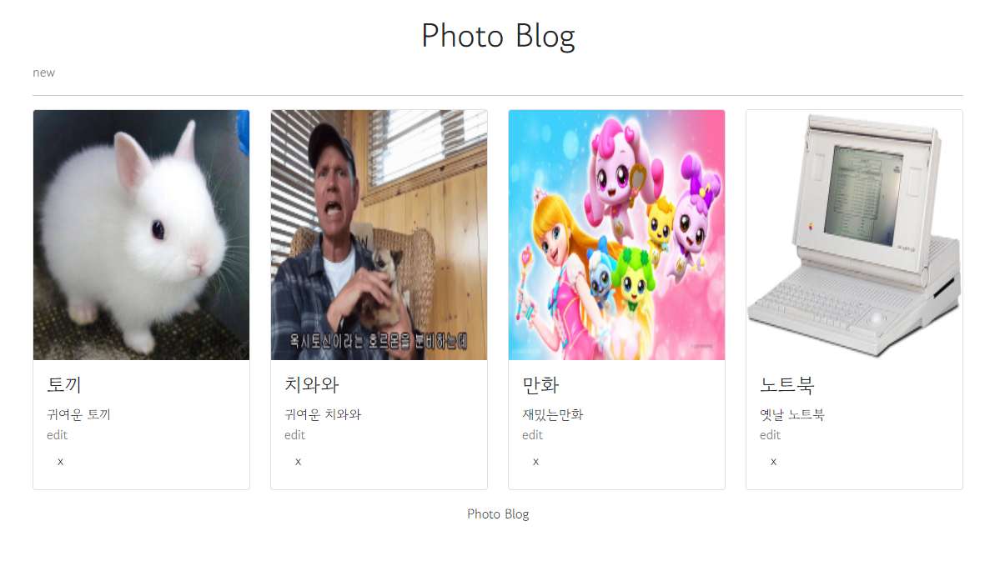
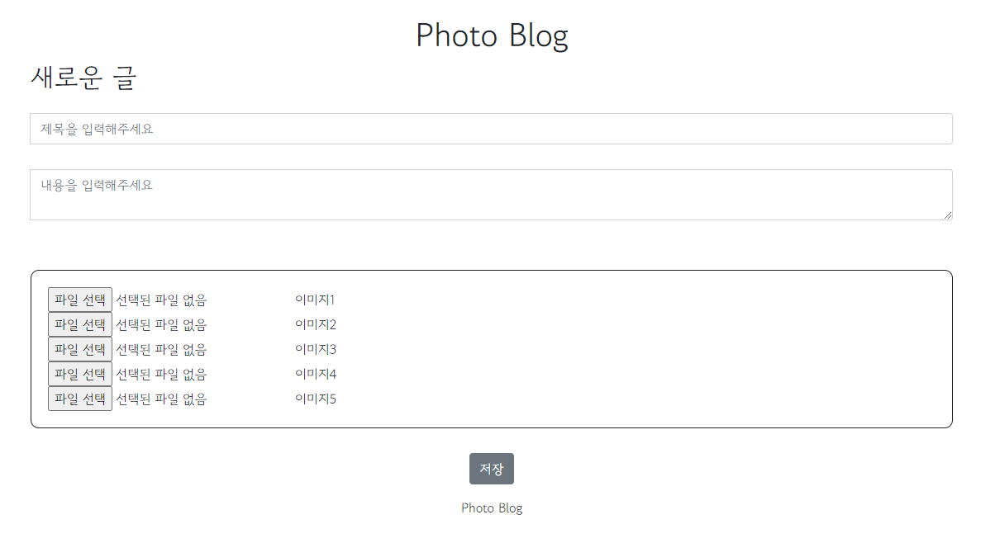
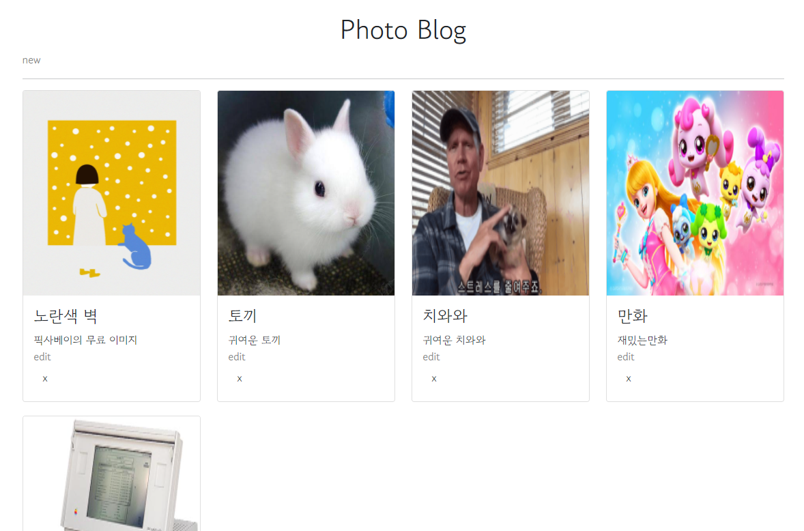
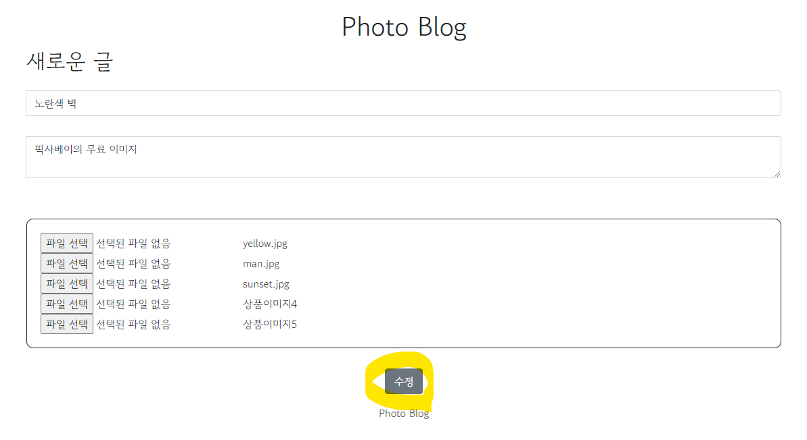
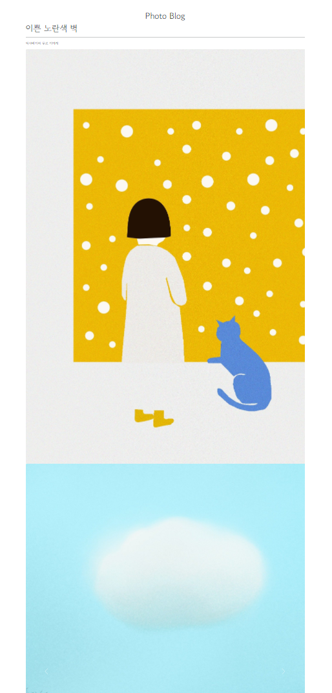

# 📷 Blog Project

이미지 업로드 및 출력을 공부하기 위한    
Photo Blog project 입니다.

## 📜 Plan

- main page: 블로그 메인화면   
- new post: 새 글 작성 페이지   
- detail page: 블로그 글 상세 페이지   

main 화면은 작성한 글을 볼 수 있는 페이지입니다.   
새 글 작성 버튼을 누르면 블로그 글을 쓸 수 있습니다.    

글 작성 시 이미지를 첨부해야 하며, 첫 이미지는 대표이미지입니다.   
이미지는 5개까지 등록할 수 있습니다.   

글 수정 버튼을 누르면 글을 수정할 수 있고, 이미지들도 수정할 수 있어야 합니다.     
글 삭제 버튼을 누르면 글과 그림을 삭제합니다.   

## 📜 package / class
### controller
MainController: 메인화면 view 리턴 (블로그 글 전체 조회)  
PostController: 블로그 글 등록,수정,삭제 view + post(delete) 리턴   

### dto
ImgDto: 이미지 업로드 시 필요한 데이터   
PostDto: 글 업로드 시 필요한 데이터   
PostFormDto: 글과 이미지 업로드 시 필요한 데이터

### entity
ImgEntity: db 에서 꺼내올 이미지 데이터
PostEntity: db 에서 꺼내올 글 데이터

### repository
ImgRepository: 이미지 repository
PostRepository: 글 repository

### service
FileService: 파일 업로드, 삭제 메소드 구현   
PostImgService: 글에다가 이미지 저장, 수정(수정 시 파일 삭제 후 재 업로드)   
PostService: 글과 이미지 저장, 수정, 조회, 삭제   

## 📜 view

### main page
블로그 메인 페이지 입니다.   
대표 이미지와 제목, 내용이 표시됩니다.   

### new page
글 작성 페이지 입니다.   
글을 다 작성하면 메인 화면으로 리다이렉트 됩니다.   

### edti page
글 수정 페이지 입니다.   
글 id 가 있으면 수정 버튼이 보이게 타임리프 if 문으로 작성했습니다.   

### detail page
글 디테일 페이지 입니다.   
등록한 이미지가 차례대로 등록됩니다.   

